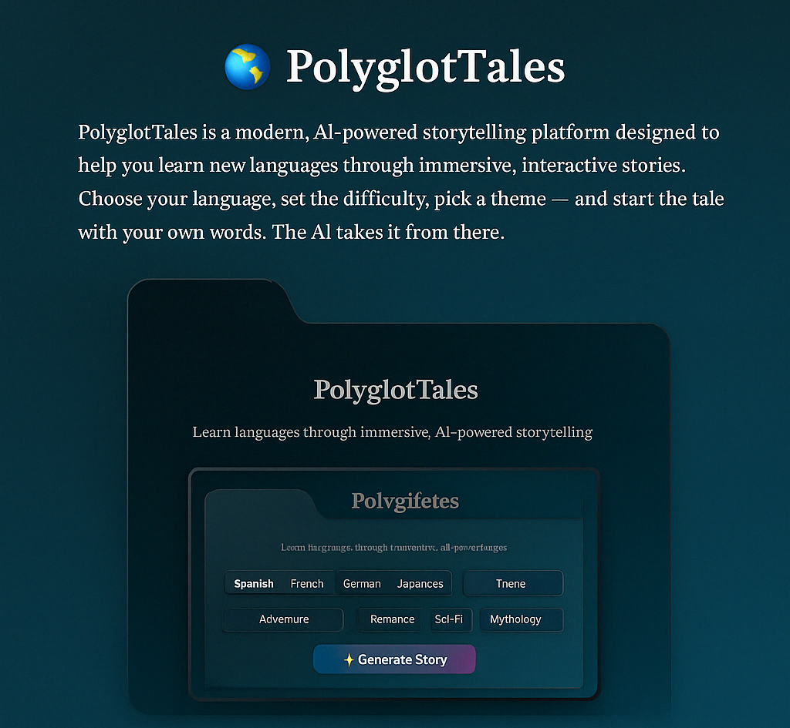

# 🌍 PolyglotTales

**PolyglotTales** is a modern, AI-powered storytelling platform designed to help you learn new languages through immersive, interactive stories. Choose your language, set the difficulty, pick a theme and start the tale with your own words. The AI takes it from there.



## ✨ Features

- 🌐 **Multilingual support**: Spanish, French, German, Japanese
- 🧠 **Difficulty levels**: Beginner, Intermediate, Advanced
- 🎭 **Story themes**: Adventure, Romance, Sci-Fi, Mythology
- ✍️ **User-generated starting line** for stories
- 🔊 **Text-to-speech (TTS)** to hear your story
- 📚 **Vocabulary booster** with extracted keywords
- 🌫️ **Glassmorphic UI** with theme toggle
- 💡 Powered by **OpenAI** (GPT-4 or DeepSeek) for storytelling

---

## 📸 Preview

> ✨ Choose → Type → Read → Listen → Learn


## 🚀 Getting Started

### 1. Clone the repo

```bash
git clone https://github.com/Nuraj250/PolyglotTales.git
cd PolyglotTales
```

### 2. Install dependencies

```bash
npm install
```

### 3. Add your OpenAI API key

Create a `.env.local` file:

```
OPENAI_API_KEY=sk-xxxxxxxxxxxxxxxxxxxxx
```

> ✅ You can also use DeepSeek or Gemini API by modifying `/api/generate.ts`

### 4. Run the app

```bash
npm run dev
```

Visit: [http://localhost:3000](http://localhost:3000)

---

## 🛠 Tech Stack

- **Framework**: Next.js 15 (Turbopack)
- **Styling**: Tailwind CSS 4 (Glassmorphism)
- **Animations**: Framer Motion
- **Language Model**: OpenAI GPT-4 / DeepSeek
- **TTS**: Native Web Speech API
- **Dark/Light Theme**: Tailwind `darkMode` via class toggle

---

## 📁 Project Structure

```
src/
│
├── components/       # Reusable UI (SelectorGroup, GlassButton)
├── pages/            # Routes (index, story, api/generate)
├── styles/           # Tailwind + global CSS
├── utils/            # Vocabulary extractor
└── context/          # (Optional) global state
```

---

## 🌟 Contribution

Want to contribute a new language, theme, or TTS support? Open a PR or start a discussion — let’s grow this together!

---

## 📄 License

MIT © 2025 [Nuraj]